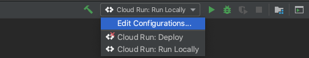

# Cloud Run Hello World with Cloud Code

"Hello World" is a [Cloud Run](https://cloud.google.com/run/docs) application that renders a simple webpage.

For details on how to use this sample as a template in Cloud Code, read the documentation for Cloud Code for [VS Code](https://cloud.google.com/code/docs/vscode/quickstart-cloud-run?utm_source=ext&utm_medium=partner&utm_campaign=CDR_kri_gcp_cloudcodereadmes_012521&utm_content=-) or [IntelliJ](https://cloud.google.com/code/docs/intellij/quickstart-cloud-run?utm_source=ext&utm_medium=partner&utm_campaign=CDR_kri_gcp_cloudcodereadmes_012521&utm_content=-).

### Table of Contents
* [Getting Started with VS Code](#getting-started-with-vs-code)
* [Getting Started with IntelliJ](#getting-started-with-intellij)
* [Sign up for User Research](#sign-up-for-user-research)

---
## Getting Started with VS Code
create mysql database buddha:
CREATE TABLE author (
  id int(12) NOT NULL AUTO_INCREMENT,
  name varchar(200) NOT NULL,
  PRIMARY KEY (id),
  UNIQUE KEY name (name)
)

insert into author(id,name) values (5,'Alan Dean Foster');
insert into author(id,name) values (19,'Brigitte Voit');
insert into author(id,name) values (3,'Cass R. Sunstein');
insert into author(id,name) values (9,'Cay S. Horstmann');
insert into author(id,name) values (16,'Dietrich Braun');
insert into author(id,name) values (8,'Gary Cornell');
insert into author(id,name) values (2,'George Lucas');
insert into author(id,name) values (6,'George R. R. Martin');
## Getting Started with IntelliJ

### Run the app locally with the Cloud Run Emulator

#### Define run configuration

1. Click the Run/Debug configurations dropdown on the top taskbar and select 'Edit Configurations'.  

2. Select 'Cloud Run: Run Locally' and specify your [builder option](https://cloud.google.com/code/docs/intellij/developing-a-cloud-run-app#defining_your_run_configuration). Cloud Code supports Docker, Jib, and Buildpacks. See the skaffold documentation on [builders](https://skaffold.dev/docs/pipeline-stages/builders/) for more information about build artifact types.  

#### Run the application
1. Click the Run/Debug configurations dropdown and select 'Cloud Run: Run Locally'. Click the run icon.  

2. View the build process in the output window. Once the build has finished, you will receive a notification from the Event Log. Click 'View' to access the local URLs for your deployed services.  

---
## Sign up for User Research

We want to hear your feedback!

The Cloud Code team is inviting our user community to sign-up to participate in Google User Experience Research. 

If you’re invited to join a study, you may try out a new product or tell us what you think about the products you use every day. At this time, Google is only sending invitations for upcoming remote studies. Once a study is complete, you’ll receive a token of thanks for your participation such as a gift card or some Google swag. 

[Sign up using this link](https://google.qualtrics.com/jfe/form/SV_4Me7SiMewdvVYhL?reserved=1&utm_source=In-product&Q_Language=en&utm_medium=own_prd&utm_campaign=Q1&productTag=clou&campaignDate=January2021&referral_code=UXbT481079) and answer a few questions about yourself, as this will help our research team match you to studies that are a great fit.
